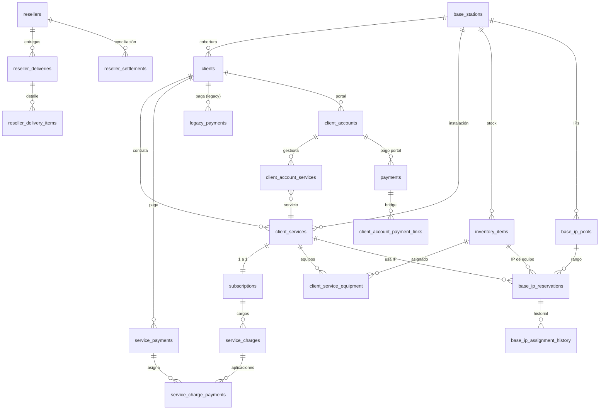

# Base de datos actual – Diccionario, ERD y reglas

## Resumen ejecutivo
- El esquema cubre operaciones de ISP y portal de clientes: bases, clientes, servicios, planes, pagos, cargos recurrentes, inventario e IPs, más módulo de revendedores y portal de cuentas. El modelo mezcla flujo nuevo (service_charges/service_payments) con estructuras legacy (legacy_payments, payments de portal) que generan duplicidad de conceptos.
- Las áreas maduras: catálogo de planes (`service_catalog`, `service_plans`, `service_plan_prices`), cartera de clientes/servicios (`clients`, `client_services`, `subscriptions`), generación de cargos/pagos por servicio, pools de IPs y asignaciones de inventario. Áreas incompletas: conciliación de revendedores (no hay detalle de uso de vouchers), pagos portal vs. pagos unificados, scheduler de recordatorios/aplicación de cargos y normalización de estados de servicio.
- Dominios cubiertos: **Internet residencial/token** (clientes/servicios, IPs, inventario), **ventas/POS** (planes, cargos, pagos, costos por base), **cyber/hotspot** (vouchers, resellers). Falta separar claramente la contabilidad de portal de clientes vs. backoffice.

## Módulos soportados
- **Internet**: bases, clientes, servicios, planes, cargos, pagos, IP pools, inventario, asignaciones de equipos.【F:db/schema.sql†L15-L317】【F:db/schema.sql†L365-L456】
- **Ventas/POS**: catálogo de servicios y precios, cargos/pagos, métricas y costos por base.【F:db/schema.sql†L27-L170】【F:db/schema.sql†L474-L518】
- **Cyber/Hotspot**: vouchers, resellers, entregas, conciliaciones.【F:db/schema.sql†L319-L403】

## Partes incompletas o a medias
- Doble registro de pagos: `legacy_payments`, `service_payments`, `payments` (portal) y `client_account_payment_links` sin unificarse.【F:db/schema.sql†L105-L198】【F:db/schema.sql†L229-L311】
- Estado de servicio/pagos duplicado entre `client_services.status`, `subscriptions.status`, cargos y cuentas de cliente; falta una única fuente de verdad.【F:db/schema.sql†L57-L103】【F:db/schema.sql†L141-L198】
- Modelo de vouchers carece de uso/consumo; solo hay entregas y conciliaciones parciales.【F:db/schema.sql†L319-L384】
- Integridad de portal de clientes incompleta: `client_accounts` guarda `estatus` y `fecha_proximo_pago` pero no se liga automáticamente con cargos/pagos unificados.【F:db/schema.sql†L229-L279】

## Diccionario de datos (resumen)

### base_stations
- **Propósito**: Catálogo de bases/coberturas; base para clientes, inventario e IPs.
- **Columnas**: `base_id` (PK, serial), `code` (text, unique), `name` (text), `location` (text), `notes` (text, null). Índices por PK implícito.
- **Relaciones**: Referenciada por `clients`, `client_services`, `resellers`, `inventory_items`, `base_ip_pools`, `expenses`, `base_operating_costs`.
- **Reglas**: Código único por base.【F:db/schema.sql†L15-L24】

### service_catalog / service_plans / service_plan_prices
- **Propósito**: Catálogo de servicios y planes con histórico de precios.
- **Columnas**: `service_catalog` incluye `code` (unique), `name`, `description`, `created_at`. `service_plans` referencia `catalog_id`, tiene `code` único por catálogo, velocidades opcionales, ciclo de facturación y metadatos. `service_plan_prices` guarda precio por `plan_id`, moneda, vigencia (`effective_from`/`effective_to`). Índices en precios por plan.
- **Relaciones**: `service_plans.plan_id` referenciado por `client_services` y `subscriptions`; precios referencian `plan_id`.
- **Reglas**: Un precio activo por combinación plan/moneda/fecha de inicio.【F:db/schema.sql†L27-L71】【F:db/schema.sql†L171-L178】

### clients
- **Propósito**: Personas/organizaciones con servicios residenciales o token.
- **Columnas**: `client_id` (UUID PK), `external_code` (unique), `client_type` (residential|token), `full_name`, `location`, `base_id` FK, `paid_months_ahead` (default 0), `debt_months` (default 0), `created_at`, `updated_at`. Índices de texto y trigram en nombre/ubicación.
- **Relaciones**: `client_services`, `subscriptions`, `payments`, `inventory_items`, `client_accounts`, `base_ip_reservations`.
- **Reglas**: Cliente puede tener múltiples servicios (1:N).【F:db/schema.sql†L73-L95】

### client_services
- **Propósito**: Servicios contratados por cliente (internet, tokens, streaming, POS).
- **Columnas**: `client_service_id` (UUID PK), `client_id` FK, `plan_id` FK, `service_type` enumerado, `display_name`, `status` (active|suspended|cancelled|pending), ciclo y día de facturación, `next_billing_date`, `price`, `currency`, `base_id`, IPs (`ip_address`, `antenna_ip`, `modem_ip`), modelos de equipo, notas, `metadata`, timestamps, `cancelled_at`. Índices por cliente, base, plan, IPs únicos condicionados.
- **Relaciones**: 1:N con `service_payments`, `service_charges`; FK a `subscriptions` (1:1) y `client_account_services`; asignación de inventario.
- **Reglas**: Un servicio único por combinación cliente+tipo+nombre; IPs únicas globales; servicio vinculado a base opcional.【F:db/schema.sql†L97-L142】【F:db/schema.sql†L150-L158】

### subscriptions
- **Propósito**: Metadatos de suscripción sobre `client_services` (1:1) para ciclos, renovación y estado.
- **Columnas**: `subscription_id` (PK=client_service_id), `client_id` FK, `plan_id` FK, `billing_cycle`, `billing_anchor_day`, `start_date`, `end_date`, `auto_renew`, `status`, `trial_ends_at`, `cancellation_reason`, timestamps.
- **Relaciones**: 1:N con `service_charges`, `service_payments`.
- **Reglas**: Estado y ciclo pueden desalinearse con `client_services` si no se sincronizan.【F:db/schema.sql†L144-L169】

### billing_periods
- **Propósito**: Periodos YYYY-MM para agrupar cargos/pagos.
- **Columnas**: `period_key` PK con check regex, `starts_on`, `ends_on` con constraint de rango.
- **Relaciones**: Referenciado por pagos y cargos.
- **Reglas**: Periodos únicos y consistentes.【F:db/schema.sql†L171-L179】

### legacy_payments
- **Propósito**: Pagos históricos por cliente y periodo sin detalle de servicio.
- **Columnas**: `payment_id` UUID PK, `client_id` FK, `period_key` FK, `paid_on`, `amount`, `months_paid` default 1, `method` enum, `note`, `created_at`. Índices por cliente/periodo.
- **Relaciones**: Paralelo a `service_payments`; no asigna cargos.
- **Reglas**: Mantener para compatibilidad; duplicidad con modelo nuevo.【F:db/schema.sql†L181-L204】

### service_payments
- **Propósito**: Pagos por servicio y/o suscripción, con asignaciones parciales.
- **Columnas**: `payment_id` UUID PK, `client_service_id` FK, `subscription_id` FK, `client_id` FK, `period_key` opcional, `paid_on`, `amount`, `months_paid`, `method`, `method_breakdown`, `note`, `recorded_by`, `created_at`. Índices por cliente, servicio, suscripción, periodo, fecha.
- **Relaciones**: Relacionado con `service_charge_payments` para asignar a cargos; compatibilidad con vista `payments_compat_view`.
- **Reglas**: Permite pagos adelantados y parciales; sin check de unicidad por periodo → requiere lógica de negocio externa.【F:db/schema.sql†L206-L246】【F:db/schema.sql†L263-L271】

### service_charges y service_charge_payments
- **Propósito**: Cargos mensuales por suscripción y su asignación de pagos.
- **Columnas**: `service_charges`: `charge_id` UUID PK, `subscription_id` FK, `client_id` FK, `period_key` FK, `charge_date`, `due_date`, `amount`, `status` enum, `notes`, `created_at` con unique por suscripción+periodo. `service_charge_payments`: `allocation_id` UUID PK, `charge_id` FK, `payment_id` FK, `amount`, `applied_on`, `notes`, `created_at` con unique por par cargo-pago. Índices por FKs y estado.
- **Relaciones**: 1:N suscripción→cargos; N:M pagos↔cargos vía allocations.
- **Reglas**: Estado del cargo controla facturación; permite aplicar pagos parciales o adelantados.【F:db/schema.sql†L248-L290】

### Portal de clientes (principal_accounts, client_accounts, client_account_services, payments, client_account_payment_links, payment_reminder_logs)
- **Propósito**: Autenticación y cobranza desde el portal.
- **Columnas clave**: `principal_accounts` (email principal, notas), `client_accounts` (correo/contraseña cifrada, perfil, estatus, fecha_próximo_pago, FK a cliente), `client_account_services` (asociación cuenta↔servicio con FK compuesta a client_services), `payments` (monto, fecha, método), `client_account_payment_links` (bridge a `service_payments`/`service_charges`), `payment_reminder_logs` (logs de recordatorios con delivery_status).
- **Relaciones**: Portal payments se pueden mapear a pagos/cargos unificados pero no es obligatorio; estatus de cuenta independiente del servicio real.
- **Reglas**: Únicos por email; una cuenta puede gestionar múltiples servicios.【F:db/schema.sql†L229-L317】

### Vouchers y revendedores
- **Propósito**: Venta de fichas prepagadas.
- **Columnas**: `voucher_types` (código único), `voucher_prices` (precio por periodo), `resellers` (FK base), `reseller_deliveries` (estado de conciliación), `reseller_delivery_items` (cantidad por tipo de voucher), `reseller_settlements` (pagos de conciliación).
- **Relaciones**: Falta vínculo con consumo real en servicios.
- **Reglas**: Precios históricos por tipo; entrega/conciliación separadas.【F:db/schema.sql†L319-L403】

### Inventario y asignaciones
- **Propósito**: Gestión de equipos (antenas, modems) y asignaciones a servicios.
- **Columnas**: `inventory_items` con `asset_tag` único, marca/modelo/serie, `base_id`, `ip_address`, `status` (assigned|available|maintenance), `client_id`, ubicación y fechas. `client_service_equipment` une servicios e inventario con historial y unicidad de asignación activa.
- **Relaciones**: 1:N base→inventario; N:M servicio↔equipo con historial.
- **Reglas**: Un equipo no puede estar activo dos veces para mismo servicio; IP opcional sin unicidad explícita (riesgo).【F:db/schema.sql†L405-L456】

### IP pools
- **Propósito**: Reservas de IP por base y asignaciones a servicios/inventario.
- **Columnas**: `base_ip_pools` (PK serial, base, label, cidr, vlan, notas); `base_ip_reservations` (UUID PK, base, pool, ip_address unique por base, status free/reserved/in_use/quarantine, referencias opcionales a servicio/equipo/cliente); `base_ip_assignment_history` registra acciones.
- **Relaciones**: 1:N base→pools; reservas referencian servicios/inventario; history 1:N a reservas.
- **Reglas**: IP única por base; constraint pool-base consistente.【F:db/schema.sql†L458-L517】

### Costos y gastos
- **Propósito**: Control de egresos y costos por base/periodo.
- **Columnas**: `expenses` (base_id, fecha, categoría, descripción, amount), `base_operating_costs` (base_id, period_key, total_cost unique).
- **Relaciones**: Vinculados a métricas de dashboard; dependen de `billing_periods`.
- **Reglas**: Un costo mensual por base y periodo.【F:db/schema.sql†L519-L540】

## Mapa entidad–relación (ERD)

**Rutas principales de negocio**: Cliente → Servicios (`client_services`/`subscriptions`) → Cargos (`service_charges`) → Pagos (`service_payments` + `service_charge_payments`), y cliente→portal (`client_accounts`→`payments`). Vouchers siguen flujo Reseller → Entregas → Items → Conciliaciones.

## Invariantes y reglas duras
- IPs únicas por servicio/equipo mediante índices parciales (`client_services` IPs, `base_ip_reservations` uniqueness por base).【F:db/schema.sql†L119-L158】【F:db/schema.sql†L469-L487】
- Cliente puede tener múltiples servicios; suscripción 1:1 por servicio; cargos únicos por suscripción y periodo.【F:db/schema.sql†L97-L142】【F:db/schema.sql†L248-L258】
- Pagos permiten parciales y anticipos mediante `service_charge_payments` y `months_paid`; no hay constraint de un pago por periodo (requiere lógica).【F:db/schema.sql†L206-L246】【F:db/schema.sql†L263-L271】
- Estados: servicios usan `subscription_status_enum` (active/suspended/cancelled/pending); cargos usan `charge_status_enum`; cuentas de cliente usan `client_account_status_enum` (activo/suspendido/moroso) y no están sincronizados automáticamente.【F:db/schema.sql†L12-L14】【F:db/schema.sql†L97-L158】【F:db/schema.sql†L229-L245】
- Portal de cuentas requiere perfiles válidos y email único; FK compuesta en `client_account_services` garantiza que la cuenta solo vincule servicios del cliente asociado.【F:db/schema.sql†L229-L276】

## Datos duplicados o conflictivos
- **Pagos**: `legacy_payments` vs. `service_payments` vs. `payments` (portal) generan tres fuentes; `payments_compat_view` intenta unificar pero solo para asignaciones a cargos.【F:db/schema.sql†L181-L246】【F:db/schema.sql†L263-L273】
- **Estado**: `client_services.status`, `subscriptions.status`, `client_accounts.estatus`, `base_ip_reservations.status` sin reconciliación; riesgo de discrepancias.
- **Mensualidad/adeudos**: `clients.paid_months_ahead` y `clients.debt_months` se superponen con `service_charges.amount/status` y `service_payments.months_paid`.
- **IPs**: almacenadas en `client_services` y en `base_ip_reservations`; falta decidir fuente de verdad (pool vs. servicio directo).
- **Próximo pago**: `client_accounts.fecha_proximo_pago` duplicado respecto a `subscriptions.next_billing_date`/`service_charges.due_date`.

## Campos legacy/deprecados
- `legacy_payments` tabla completa (mantenida para compatibilidad).
- `clients.paid_months_ahead` y `debt_months` reflejan lógica antigua de mensualidades agregadas; deberían reemplazarse por cargos/pagos por servicio.
- `payments` (portal) sin asignar a cargos es legacy temporal hasta migrar a `service_payments` + `client_account_payment_links`.

## Referencias y migraciones
- Snapshot de esquema: `db/schema.sql` (sincronizado con Alembic).【F:db/schema.sql†L1-L541】
- Migraciones: `backend/alembic/versions/*.py` (10 versiones hasta `20250320_0010_service_plan_catalog.py`).【F:backend/alembic/versions/20250320_0010_service_plan_catalog.py†L1-L23】
- Comandos para generar esquema:
  - PostgreSQL: `pg_dump --schema-only --no-owner --no-privileges $DATABASE_URL > db/schema.sql`.
  - SQLite (por defecto local): `sqlite3 backend/clients.db '.schema' > /tmp/schema.sql`.
  - Estado de migraciones: `cd backend && alembic history` y `alembic current`.
