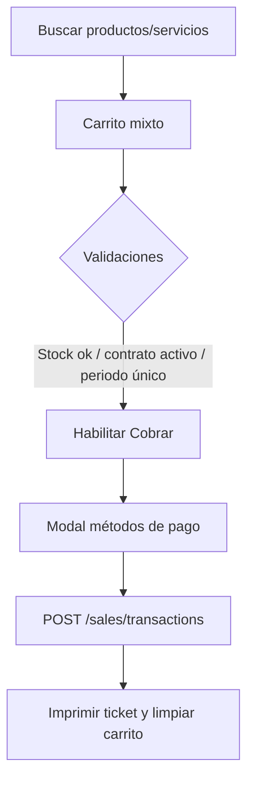
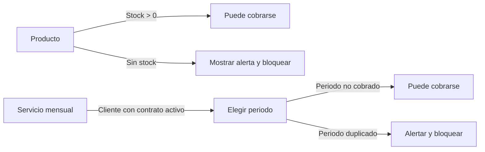

# Flujo actual de pagos en el POS

Este documento resume cómo funciona hoy el TPV para cobrar productos y servicios, según la implementación en `src/pages/PointOfSale.jsx`.

## Panorama general
- **Botón único y flujo unificado**:
  - El TPV solo muestra el botón **Cobrar**. Tanto productos como servicios mensuales pasan por el mismo modal de pago.
  - El registro se realiza únicamente vía `/sales/transactions`, eliminando la ruta paralela `/payments` para cobros rápidos.
- **Carrito mixto**: el buscador admite productos, servicios puntuales y servicios mensuales. Las líneas guardan su tipo para validar stock, contrato o periodo antes de cobrar.
- **Validaciones previas al cobro**:
  - El botón Cobrar exige al menos un artículo y que no haya alertas pendientes.
  - **Productos**: requieren stock suficiente.
  - **Servicios mensuales**: requieren cliente con contrato activo, un periodo seleccionado y bloquean cobros duplicados del mismo periodo.
  - **Descuentos/reembolsos**: si hay descuento, se exige referencia de reembolso reutilizando la lógica del modal actual.

## Flujos por escenario (botón único)
### 1) Cliente paga solo productos de inventario
1. Buscar/agregar productos al carrito (no exige cliente si solo hay productos).
2. Si el stock es suficiente, pulsar **Cobrar**, dividir métodos en el modal si aplica y confirmar.
3. La venta se registra y limpia el ticket.

### 2) Cliente paga solo su internet
1. Seleccionar al cliente.
2. Agregar el servicio mensual de internet (solo se permite con contrato activo) y seleccionar el periodo a cubrir.
3. Pulsar **Cobrar**; el flujo valida duplicados del periodo y registra la transacción en `/sales/transactions`.

### 3) Cliente paga internet y Spotify
1. Seleccionar cliente con contrato activo.
2. Agregar ambos servicios mensuales al carrito (internet + Spotify) desde el buscador.
3. Cobrar con **Cobrar**; el ticket mezcla ambos servicios y los valida por periodo antes de registrar.

### 4) Cliente con 3 servicios activos paga solo internet
1. Seleccionar cliente.
2. Agregar únicamente el servicio de internet al carrito y elegir su periodo; los otros servicios no se cobran.
3. Pulsar **Cobrar**; el ticket muestra solo la línea de internet.

### 5) Cliente paga internet y compra un lápiz
1. Seleccionar cliente.
2. Agregar el servicio mensual de internet y el producto de papelería al carrito.
3. Pulsar **Cobrar**; el ticket mezcla ambos tipos y valida stock solo para el producto.

## Diagramas rápidos

### Cobro único con carrito mixto

### Reglas de validación por tipo de ítem

## Notas de configuración
- **Feature flag**: habilitar `POS_UNIFIED_PAYMENT_FLOW` para ocultar el botón antiguo de “Registrar pago” y activar el modal único.
- **Rutas backend**:
  - `/sales/transactions`: única ruta para registrar tanto productos como servicios (incluye metadata de periodo en las líneas de servicio).
  - `/catalog/services/:id/periods` (GET): obtener periodos disponibles del servicio antes de cobrar.
  - `/inventory/products/:id/stock` (GET): validar stock al agregar productos.
- **Limpieza de estado**: al cambiar de cliente, vaciar carrito y recargar servicios activos para evitar mezcla de periodos.

## Changelog vs flujo anterior
- Se eliminó el botón **Registrar pago** y el panel de pagos rápidos; todo pasa por el botón **Cobrar**.
- Los servicios mensuales se agregan al carrito y se validan junto a los productos en el mismo modal.
- Los cobros de servicios se registran en `/sales/transactions` en lugar de `/payments`.
- Las validaciones de periodo (duplicados) y contrato activo se muestran en línea dentro del carrito.
